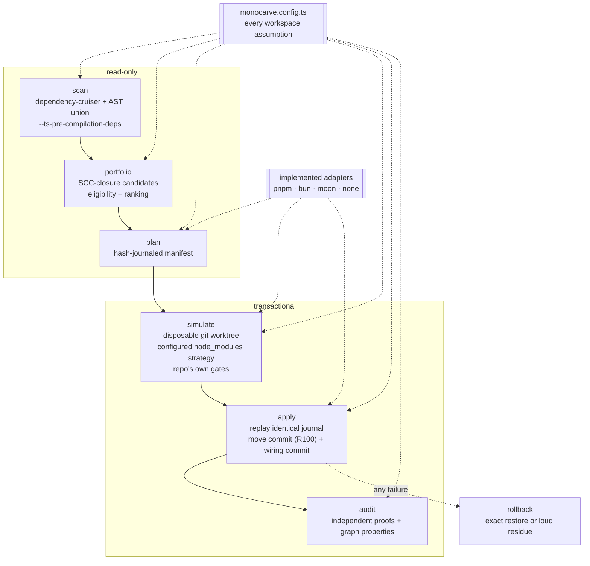

# monocarve

[](https://github.com/gabrielbryk/monocarve/actions/workflows/ci.yml)
[](LICENSE)

A deterministic **extraction compiler** for TypeScript monorepos.

It decomposes large applications into workspace packages via compiled,
replayable, hash-verified plans. Instead of doing a refactor, it _compiles_ one —
a manifest that says exactly which bytes move where, what each file must hash to
before and after, and which commits result. That manifest is then simulated in a
disposable worktree, replayed into the real checkout, and audited for byte
fidelity afterwards.

> **Status: v1 is Bun-only.** The supported workspace adapters are pnpm and bun
> for package management and moon or `none` for task-runner integration. See
> [the operator guide](docs/operator-guide.md) before applying a plan.

Monocarve is intentionally conservative. Start with `scan`, `portfolio`, and
`plan`; applying a plan is a separate, explicit transaction that first proves
the same journal in a disposable worktree.

To explore the same dependency model visually, run:

```sh
monocarve visualize
```

This opens a loopback-only interactive web UI. Its default architecture view
aggregates SCCs by configured domain and turns each domain's strongest outgoing
dependency into a deterministic parent edge. Cycles are broken deterministically,
the resulting dependency trees are packed as separate spatial islands, and the
largest island is focused initially. Select a node to highlight its local
relationships, overlay the broader backbone or all connections when needed, or
double-click a domain to drill into the underlying components. The component view collapses import cycles into
their atomic SCCs and lays them out by dependency layer. Both views support
zooming, application/domain scoping, search, typed-edge filtering, inspection,
explicit live rescans, and an agent-oriented high-contrast rendering with white
background, black directional edges, and strongly bordered labels. Use `--app <name>` to constrain the scan itself or
`--no-open` when running remotely.

## Why

Carving a package out of a mature application is mechanically simple and
practically terrifying. The work is repetitive — move files, repoint imports,
scaffold a package, update the lockfile — and the failure mode is silent: one
file subtly rewritten during the move, one consumer left pointing at a path that
still resolves, one dynamic import that quietly became static. Reviewers cannot
see any of that in a 400-file diff, and tests do not necessarily catch it.

The premise here is that this class of refactor should be _compiled and verified_
rather than performed:

- **Deterministic.** Same repo, same commit, same plan — byte for byte. Nothing
  about the output depends on when it ran or who ran it: even the manifest's
  `createdAt` is the baseline commit's committer date, not a clock reading.
- **Replayable.** The plan is a journal. Applying it is executing the journal;
  simulating it is executing the same journal somewhere disposable.
- **Hash-verified.** Every operation declares the hash it expects to find and the
  hash it must produce. Drift fails at the first operation instead of halfway.
- **Provable, about content.** "Did any byte change?" reduces to hash
  comparisons plus one replay proof for the single operation kind that
  legitimately edits content, and "does the package have the boundary the plan
  promised?" is proven against the landed tree. What that does _not_ prove is
  behaviour: consumers are repointed at a barrel that re-exports the whole moved
  closure, so a module a consumer never named is now evaluated on import. That
  risk is inventoried per module and warned about at plan time, not proven
  absent.
- **Reviewable.** Two commits: a pure-rename move commit that git reports as
  R100, and a wiring commit that contains every actual content change.

## Architecture



### The pipeline

**scan** — build a dependency model with dependency-cruiser, with
`--ts-pre-compilation-deps` so type-only edges are visible (a type-only escape is
still an escape). The cruiser result is the base, not the truth: it is unioned
with an AST pass that recovers unresolved workspace subpath imports, `export *`
re-exports, and dynamic `import()` specifiers. Output is narrowed to a small
model so a different scanner can replace it.

**portfolio** — enumerate candidates as SCC closures: seed on a strongly
connected component, take its transitive first-party closure, add the tests that
cover it and every asset it imports. Then apply eligibility:

| rule                       | meaning                                                                                               |
| -------------------------- | ----------------------------------------------------------------------------------------------------- |
| containment                | no relative import leaves the closure…                                                                |
| …except rewritable escapes | …unless it lands on a symbol an existing package already exports, which becomes a `move-with-rewrite` |
| asset-inclusive closures   | a `./styles.css` import is legal _because_ the asset moves too, byte-identically                      |
| single owner               | exactly one application owns the closure                                                              |
| no composition roots       | entrypoints and DI wiring never leave                                                                 |
| has a surface              | something is exported, and something consumes it                                                      |
| not `.d.ts`-only           | types with no implementation belong somewhere else                                                    |

Runtime-domain crossing is _not_ a rejection — it scores down and raises a
warning, because that split is often the very thing the extraction fixes.
Rejections carry the concrete edges to break, which is what `backlog` prints.

**plan** — compile one candidate into a manifest: baseline commit, source blob
hashes, and an ordered journal of operations, each with a precondition hash and a
result hash.

| operation           | what it does                                                                                                                                                                                                                                                                                                           |
| ------------------- | ---------------------------------------------------------------------------------------------------------------------------------------------------------------------------------------------------------------------------------------------------------------------------------------------------------------------- |
| `move`              | byte-identical relocation; `resultHash === preconditionHash`. Assets too.                                                                                                                                                                                                                                              |
| `rewrite-import`    | consumer that stays put, repointed at the new package (AST edit)                                                                                                                                                                                                                                                       |
| `write-file`        | package scaffolding rendered from config templates                                                                                                                                                                                                                                                                     |
| `lockfile-importer` | one importer block inserted at its sorted position — so a plan never embeds a whole lockfile. Both shapes a package manager writes are read and produced, the block form and the inline `root: {}` an importer with no dependencies gets. Run `--verify-lockfile` to check the splice against the real package manager |
| `move-with-rewrite` | the only kind whose content changes as it moves; excluded from the R100 check and staged into the wiring commit as delete + add                                                                                                                                                                                        |

Plus consumer rewrites, Conventional Commit subjects rendered from config, a
declared `expectedDynamicImportDelta` the audit holds it to, and an
`evaluationEffects` inventory: what importing the new package does when it is
_evaluated_, rather than when something in it is called. The portfolio warns
whenever it is non-empty, because a consumer that used to deep-import one module
will now evaluate all of them, in barrel order.

### Provenance is the manifest, not a commit trailer

The committed manifest is the extraction's provenance record: its `planId`,
baseline commit, source and operation hashes, declared operations, rendered
commit metadata, plus the retained audit report, make the reviewed change
independently inspectable. The audit validates the landed tree against that
record.

Commit subjects and optional bodies are workspace policy, rendered only from
`commitTemplates`. For the commits `apply` creates, a configured body is
appended verbatim; an empty body is the generic default. Monocarve does not
invent, require, or validate an `Extraction-Proof` trailer. A workspace may
configure a trailer, co-author, or other body text for its own process, but it
is not the evidence that an extraction occurred or passed audit.

The inventory covers the **evaluation closure**, not the moved set. Starting
from the moved files it follows the edges that actually cause evaluation —
static imports, re-exports, `require` — through bare imports of workspace
packages and into those packages' own modules, and records each one as `moved`
(relocated by this plan, listed at its target path) or `reached` (not moved, at
the path where it stays, now running for importers that never named it).
`type-only` edges are not followed, because they are erased before anything
runs, and neither are `dynamic` ones, because `import()` is lazy and
`expectedDynamicImportDelta` already tracks it. The traversal stops at
`node_modules`: third-party packages are recorded by name together with their
own `sideEffects` declaration, where "claims none", "says nothing" and "not
installed, so nothing was read" stay three distinct answers.

Read that inventory for what it is. It over-approximates the effects it
reports — every top-level call counts and most are harmless — and it is a
syntactic scan, so a module missing from it has not been shown to be pure.
Nothing inside a third-party package is parsed. And it is a _set_: it says
nothing about the order the barrel imposes, which is exactly what matters when
two modules' effects interact, and which the plan chose when it chose the
barrel's `export *` order.

**apply** — simulate the whole journal in a disposable worktree at the baseline
commit, with the configured `node_modules` strategy, and run the repository's
own gates there. `transaction.nodeModules` defaults to `symlink`; use `install`
where linked dependencies are unsuitable, or `none` when the gates do not need
them.
Only then replay the identical hashed operations in the real checkout, producing
the move commit and the wiring commit. Any failure rolls back.

For a reviewed plan that is ready to land, invoke `apply --commit` directly: it
performs that mandatory simulation once and then applies. Standalone `apply`
without `--commit` is for feasibility or review when landing is not yet intended.
Do not run both back-to-back; the committed invocation intentionally simulates
again rather than trusting stale cached evidence.

Between the journal and the gates, in both trees, the declared **generated
artifacts** are regenerated: a registry, barrel, or ledger that a move
invalidates is not something the plan can write, and a workspace that checks its
own generated output would otherwise fail every gate on staleness the extraction
caused and the plan could not fix. Which artifacts run is decided by the same
`triggers` predicate that attached them to the plan; the command is the config's,
the plan must agree with it, and a config that has grown an artifact the plan
predates stops the run rather than leaving it stale. The regenerated paths are in
`changedFiles` and land in the wiring commit, so the plan still describes exactly
what an apply does. A non-zero exit aborts like a failed gate, with the
generator's own output attached.

**audit** — independent proofs, each of which can fail on its own: byte fidelity
(every moved file, every rewritten consumer and every file the plan _wrote_ must
hash to what its operation declared),
consumer completeness (specifier comparison _and_ re-resolution, so no edge
points into a moved path), boundary rules, an external-consumer compile proof, a
codemod replay proof that re-derives every `move-with-rewrite` file from its
baseline blob and demands byte equality, and an entrypoint-closure proof that
parses the _landed_ barrel and rejects any module it evaluates beyond the set the
plan declared — plus lockfile-importer and generated-artifact integrity, and a
graph property check that holds the dynamic-import multiset to what the plan
declared.

Two things the audit deliberately does not claim. A `write-file` operation's
bytes are reproduced, not judged: the landed `package.json`, `tsconfig.json`,
task-runner project file and barrel must hash to what the plan declared, which
says the tree holds the bytes this plan chose and never that those were the right
bytes to choose — the entrypoint-closure proof is the cross-check that keeps one
of them honest, because it derives the barrel it expects from `source.files`
rather than from the operation. And the `evaluationEffects` inventory is declared
and bounded, not verified: the audit proves the barrel evaluates nothing outside
the set of modules this plan _moves_, which is neither a claim that those
modules' effects are benign nor a re-derivation of the closure. The closure is
not re-walked at audit time — doing so would re-resolve and re-parse every
reachable module, and would check the plan against the same code that produced
it.

The lockfile check is a third. A plan hashes the lockfile its own splicer
produced, and the audit re-reads the landed block with the same parser — internal
consistency, which catches tampering and drift and cannot catch a splice the
package manager itself would never write. `apply --verify-lockfile` (also
`plan --verify-lockfile` before writing, or `next --apply --verify-lockfile` and
`apply --verify-lockfile` during simulation, regenerates the lockfile in the simulation
worktree with the package manager and fails on any difference. It is opt-in
because it costs a package-manager run, and when it is asked for, a package
manager that is missing or that fails is an error rather than a skip.

All of it reads the tree as _that plan_ left it, not the repository as it stands
today. The equalities are strict on purpose — moved, rewritten and written bytes,
the landed lockfile block, the barrel's evaluated module set — so anything that
legitimately touches those paths later makes the audit red. Extracting a second
time into the same package rewrites its `package.json` and its barrel by design,
and the first plan's audit fails against the result. Audit a plan against the
tree it produced.

## Install

Monocarve runs on Bun. Node is not a supported runtime for the CLI or its
TypeScript configuration loader.

**Platform support.** Linux is the supported and CI-tested platform. macOS and
Windows are untested. `assess`, assessment replay, and declaration batch run
executable TypeScript/ESM config inside a filesystem sandbox that requires
`bwrap`, `strace`, and unprivileged user namespaces. Without them, those
commands refuse executable config (JSON config still works).

```bash
bun add --dev monocarve
bunx monocarve --help
```

To try an unpublished checkout or contribute to the project:

```bash
bun install --frozen-lockfile
bun run check       # typecheck, tests, file-size limit, and complexity policy
bun run build:bundle
bun run verify-package
```

## Quick start

Configure the target workspace first; the names below are synthetic examples,
not defaults. A complete working configuration lives in
[`fixtures/basic-monorepo/monocarve.config.json`](fixtures/basic-monorepo/monocarve.config.json).

```bash
bunx monocarve config-doctor
bunx monocarve scan --app web
bunx monocarve portfolio --limit 10
bunx monocarve plan --candidate c-09d8a524b603 --package-name @acme/chart --write
bunx monocarve plan-review --plan .monocarve/plans/c-09d8a524b603.json
```

Stop there on a first evaluation. Before approving or applying a plan, follow
the [operator guide](docs/operator-guide.md), commit the reviewed manifest, and
make sure the configured gates describe the repository's own required checks.

After `bun run build`, use `./artifacts/monocarve` directly from any target
workspace. It is a standalone executable with Bun embedded; `dist/monocarve.js`
is the smaller Bun-runtime package binary. `bun run build:bundle` emits only the
publishable `dist/` JavaScript and declaration files.

The quality policy rejects any TypeScript source, test, or script over 500
lines. Its structural complexity check enforces cyclomatic, cognitive, nesting,
method-size, fan-out, and composite structural thresholds. Both checks print
the exact files and metrics to fix; they have no baseline exemptions.

Bun-only: the config may be a `.ts` file, the CLI is a `.ts` entrypoint, and the
test runner is `bun run test` (the wrapper sets the scratch root and timeout;
bare `bun test` scatters scratch directories and uses a 5s timeout that several
subprocess-backed tests exceed). A JSON config changes the config format, not the
runtime support policy.

For the complete safe operating sequence, including manifest review, the
required plan commit, preflight, simulation, recovery, and audit, read the
[operator guide](docs/operator-guide.md). For every command and flag, see the
[CLI reference](docs/cli-reference.md).

### Core commands

These are the main workflow commands, not the complete registry. Run
`monocarve --help` for every command and the
[CLI reference](docs/cli-reference.md) for every flag.

| command                                                                                                    | does                                                                                                                     |
| ---------------------------------------------------------------------------------------------------------- | ------------------------------------------------------------------------------------------------------------------------ |
| `scan`                                                                                                     | build the dependency model, print a summary                                                                              |
| `config-doctor`                                                                                            | explain effective configuration and workspace integration without writing                                                |
| `symbols --file <path>`                                                                                    | read-only declaration graph with type/value edges and declaration SCCs                                                   |
| `split-candidates --file <path>`                                                                           | rank declaration SCCs using cross-file consumers and configured domain affinity                                          |
| `capabilities --file <path> --type <interface>`                                                            | partition broad contexts by real compiler-resolved property consumers                                                    |
| `lazy-registry --file <path>`                                                                              | map dynamic feature entries to current candidate closures and package targets                                            |
| `hotspots`                                                                                                 | rank modules that inflate extraction closures and name the preparation lever                                             |
| `impact --plan <preparation>`                                                                              | run a gated counterfactual and compare exact before/after extraction capacity                                            |
| `seams --file <path> --candidate <id>`                                                                     | propose a declaration partition and report type-only preparation safety                                                  |
| `seams-multi --file <path> --file <path>`                                                                  | analyze exact declaration SCCs across multiple files                                                                     |
| `prepare-plan`                                                                                             | compile a reviewed, replayable type-only declaration preparation                                                         |
| `prepare-multi-plan`                                                                                       | compile reviewed per-donor seams into one atomic multi-file preparation                                                  |
| `prepare-apply` / `prepare-audit`                                                                          | simulate or commit a preparation, then independently replay its proof                                                    |
| `preparer-plan` / `preparer-bootstrap-commit` / `preparer-simulate` / `preparer-apply` / `preparer-commit` | compile, bootstrap through normal hooks, prove, journal-apply, and explicitly commit configured declared-output ratchets |
| `campaign resolve`                                                                                         | re-scan and resolve the next ordered `{path, packageName}` target; compile at most one plan and stop for review          |
| `campaign optimize`                                                                                        | emit ROI-ranked stable targets and coupling preparation priorities                                                       |
| legacy `campaign init/status/advance/record`                                                               | finish an existing schema-v1 preparation/extraction pair ledger                                                          |
| `portfolio`                                                                                                | grouped candidates with separate mechanical eligibility and architectural recommendation                                 |
| `scope`                                                                                                    | resolve a stable source path to its current candidate and review an intentional target                                   |
| `conflicts --plan <candidate>=<manifest> ...`                                                              | exact same-baseline operation conflicts and path-disjoint planning waves                                                 |
| `plan`                                                                                                     | compile a plan for one candidate; reports explicit `targetMode` and `targetPackageRoot` for new or existing packages     |
| `plan-review`                                                                                              | render the deterministic human review and exact approval inputs                                                          |
| `refresh`                                                                                                  | explicitly recompile a stale plan at current `HEAD` without silent replacement                                           |
| `approve`                                                                                                  | inspect exact manifest approval evidence; `--commit` commits only that manifest and refuses unrelated dirt               |
| `relocate-tests`                                                                                           | compile a configured leaf integration-test package                                                                       |
| `apply`                                                                                                    | simulate, then apply as verified commits                                                                                 |
| `apply-status` / `apply-recover`                                                                           | inspect or safely release a stopped committing-apply owner                                                               |
| `doctor`                                                                                                   | replay, audit, and run gates in an isolated worktree                                                                     |
| `inspect-gates`                                                                                            | run gates separately in isolation and attribute generated or undeclared paths                                            |
| `audit`                                                                                                    | verify an applied plan's declared bytes, boundaries, and replay proofs                                                   |
| `verify`                                                                                                   | validate a plan + apply preflight, touching nothing                                                                      |
| `next`                                                                                                     | pick the highest-scoring candidate and plan it (`--apply` also simulates)                                                |
| `backlog`                                                                                                  | blocked candidates with the concrete edges to break                                                                      |
| `layers`                                                                                                   | read-only decomposition report: domains, components, layers                                                              |
| `check import-extensions`                                                                                  | relative specifiers inside packages that lack an explicit extension                                                      |

Ordinary graph-reading commands accept `--graph <app>=<file>`, which replays a
captured scanner report instead of cruising again — scanning a large application
costs tens of seconds, and each invocation is a fresh process. Campaign `init`,
`advance`, and `record` deliberately refuse captured reports because their
ledger transitions require fresh native scan evidence.

`conflicts` never declares same-baseline plans safe to apply sequentially.
Even a structured edit classified as mergeable carries incompatible journal
hashes after the first child lands, so every reported wave explicitly requires
rescan and replan between children. `symbols` is likewise diagnostic only: its
stable declaration groups are the future unit of file splitting, but it does
not edit or move a declaration.

Declaration preparation is opt-in. A workspace must configure
`preparation.commit` and at least one command under `preparation.gates`; the
tool refuses to invent either policy or certify a zero-gate source rewrite.
Preparation manifests are separate from extraction manifests, so the ordinary
whole-file move commit remains an R100 rename.

### Reading `portfolio` and `backlog`

Both print one _slice_ of one partition of the portfolio, and both take
`--limit` (default 20). So both report the slice and the population separately,
and the counts never depend on the limit:

```jsonc
{
  "schema": "portfolio",
  "totals": { "candidates": 662, "eligible": 136, "blocked": 526 }, // whole portfolio, always
  "limit": 20,
  "truncated": true, // there are more eligible candidates than `top` holds
  "top": [/* the 20 highest-scoring eligible candidates */],
  "selected": [/* ids */],
}
```

`backlog` has the same `totals`, `limit` and `truncated`, and its `top` holds the
largest blocked candidates with the edges to break. `totals.eligible +
totals.blocked === totals.candidates` in both, by construction.

Read the counts from `totals` and never from `top.length`: `top` is what the
limit left standing. (Before this shape, the truncated array was called
`candidates` and sat beside an untruncated `blocked` count — two numbers over
different populations, which is a report that cannot be reconciled and was
twice read as a real shortfall.)

## Configuration

`monocarve.config.ts` (or `.json`), discovered by walking up from the working
directory. **This schema is the genericity boundary**: if the engine needs to
know something about a particular repository, it comes from here. Nothing about a
specific workspace is hardcoded anywhere in `src/`.

| field                  | purpose                                                                                                                                                                                                                                                                                                                 |
| ---------------------- | ----------------------------------------------------------------------------------------------------------------------------------------------------------------------------------------------------------------------------------------------------------------------------------------------------------------------- |
| `applications[]`       | `name`, `sourceRoot`, `tsconfig`, optional `packageName`, `project`, `compositionRoots`, `compilerProfile` (`lib`, `types`, `jsx`, `moduleResolution`, `esModuleInterop`, `allowSyntheticDefaultImports` — the external-consumer proof has to compile the way the application itself does), per-app `scaffoldTemplates` |
| `packageRoots[]`       | where packages live (`libs/`, `packages/`), in preference order                                                                                                                                                                                                                                                         |
| `packageScope`         | scope prefix for generated names (`@acme/`)                                                                                                                                                                                                                                                                             |
| `packageManager`       | selects the adapter: workspace membership + lockfile ops                                                                                                                                                                                                                                                                |
| `taskRunner`           | selects the adapter: project files + gate invocation                                                                                                                                                                                                                                                                    |
| `gates`                | command templates per tier (`package`, `project`, `workspace`) with `{package}`, `{packageRoot}`, `{project}`, `{app}`                                                                                                                                                                                                  |
| `commitTemplates`      | `plan` / `move` / `wiring` subjects (single-line enforced), plus an optional shared commit body rendered verbatim from workspace config; default body is empty                                                                                                                                                          |
| `testKinds`            | mutually exclusive `unit`, `integration`, and `e2e` path classifiers; ordinary extraction moves only unit tests                                                                                                                                                                                                         |
| `testPathPatterns`     | legacy unit-test regexes; cannot be combined with `testKinds`                                                                                                                                                                                                                                                           |
| `sourceExtensions`     | compiler-owned source-module suffixes; defaults to generic TypeScript/JavaScript module forms and may be replaced by workspace policy                                                                                                                                                                                   |
| `assetExtensions`      | extensions treated as movable assets; a scaffold containing one cannot retain a blanket `sideEffects: false` claim                                                                                                                                                                                                      |
| `cssImportExtensions`  | configured asset extensions whose files contain ordered CSS `@import` references that must be discovered and rewritten                                                                                                                                                                                                  |
| `assetEmissionProofs`  | optional build command plus output roots/extensions; compares baseline and landed CSS selector sets and declaration order                                                                                                                                                                                               |
| `guardedBranches`      | branches on which `apply` refuses to commit                                                                                                                                                                                                                                                                             |
| `scaffoldTemplates`    | required workspace-owned `package.json` template plus optional `tsconfig` / task-file / `extraFiles`, `entrypoint`, baseline `devDependencies`, `barrelExport`, `barrelSpecifier`, and opt-in module-preserving `publicSurface` subpaths                                                                                |
| `portfolio`            | `domains`, `nestedDomainRoots`, `frameworkPackages`, `compositionRootPatterns`, `minFiles`, `maxFiles`, scoring `weights`, `extracted` ids to skip                                                                                                                                                                      |
| `firstPartyRoots`      | roots that are first-party but neither application nor package (generated, shared)                                                                                                                                                                                                                                      |
| `firstPartyPackages`   | `root` + `name` pairs for an exact-root first-party package (the root itself is the package, unlike `packageRoots`); the declared `name` drives dependency inference                                                                                                                                                    |
| `packageNamePattern`   | what a generated package name must look like; defaults from `packageScope`                                                                                                                                                                                                                                              |
| `generatedArtifacts`   | provenance-header patterns, plus artifacts a move invalidates (`path`, `source`, `regenerate`, `triggers`, `exemptReason`) and the per-command `timeoutMs` their regeneration gets — its own budget, because a codegen command is not a gate tier                                                                       |
| `postJournalPreparers` | ordered anchored `replacements`, exact `creates`, optional declared-output commands, and verification run after moves and dependency installation but before audit/gates; optional `emittedModuleSpecifiers` rewrites exact generator-template imports                                                                  |
| `preparers`            | pre-extraction declared-output policies: optional ordered text `replacements`, declarative file `creates`, an optional repository command and verification, and exact commit metadata                                                                                                                                   |
| `dependencyPruning`    | `mode: "report"` (default) records possible donor dependency orphans; `apply` removes reviewed candidates. Configured tests and tsconfig `types` count as consumers; `keep` retains irreducible tool/runtime dependencies by repository policy.                                                                         |
| `graph`                | `tsPreCompilationDeps`, extra cruiser config, `exclude`, `cache`                                                                                                                                                                                                                                                        |
| `transaction`          | `allowDirtyPaths`, `worktreeRoot`, `nodeModules` strategy, cleanup policy, gate retries, and simulation behavior                                                                                                                                                                                                        |
| `preparation`          | repository gates and commit policy required for type-only declaration preparation                                                                                                                                                                                                                                       |
| `pathMigrations`       | deterministic text-filter commands for path-keyed artifacts whose keys must follow moves                                                                                                                                                                                                                                |
| `planDir`              | where compiled manifests are written                                                                                                                                                                                                                                                                                    |
| `campaignDir`          | git-ignored mutable campaign ledgers                                                                                                                                                                                                                                                                                    |
| `moduleSpecifierCalls` | qualified calls whose first argument is a rewritable module path                                                                                                                                                                                                                                                        |

A working example lives at `fixtures/basic-monorepo/monocarve.config.json`.

Validation is **zod** rather than typebox: the config is human-authored and read
once per run, so path-precise error messages matter more than validation speed.

### Declarative preparer replacements

`preparers[].replacements` handles small deterministic source edits without a
repository-owned helper script. Replacements run in array order, so later items
see earlier results. Every item names a declared `outputs` path and provides
`before`, `after`, and at least one non-empty `prefix` or `suffix` anchor:

```ts
preparers: [
  {
    id: "tighten-widget-limit",
    phase: "pre-extraction",
    replacements: [{ path: "{sourcePath}", prefix: "export const widget = { ", before: "limit: 10", after: "limit: 20", suffix: " };" }],
    outputs: ["{sourcePath}"],
    commit: { subject: "refactor: tighten widget limit" },
  },
];
```

The writable state is exactly `prefix + before + suffix`. It must occur once;
multiple matches are refused. A rerun is idempotent only when the corresponding
anchored after-state occurs exactly once, or when an ordered chain for the same
path and anchors is already at its terminal after-state. An unanchored `after`
token elsewhere in the file is not evidence that the edit landed.

Every replacement path must appear in `outputs`, and planning refuses any other
repository-visible write. A preparer may configure `replacements`, `command`,
or both. When both exist, replacements run first, the command runs second, and
the optional `verify` command runs last in the disposable planning worktree.
Only the replacement `path` is template-rendered. The `before`, `after`,
`prefix`, and `suffix` fields are literal source text, so ordinary syntax such
as JSX braces is preserved exactly. The manifest captures that resolved path,
literal replacement policy, and final output bytes; real-checkout application
replays those reviewed bytes through the journal.

`preparers[].creates` declares exact new UTF-8 files without a helper command.
Paths use binding templates and automatically become outputs; contents remain
literal, and mode is `0o644` by default or explicitly `0o755`. Planning accepts
only a missing path or an already-created exact byte-and-mode match, and rejects
duplicates (including repeating its automatic output), replacement/create
overlap, different existing state, and workspace
escape. When operations coexist, their order is replacements, creates, optional
command, then optional verification. The manifest and journal preserve the exact
absence-or-file precondition, result hash, contents, and mode for simulation,
application, rollback, commit proof, and replay validation.

### Scaffold templates are workspace policy

Monocarve deliberately has no built-in workspace scaffold. The root
`scaffoldTemplates.packageJson` is required, and every optional template is
absent unless the workspace supplies it. An application may override the root
package template and may supply its own optional `tsconfig`, task file,
`extraFiles`, or `devDependencies`, including fields absent at the root. Put
package metadata, task-runner files, TypeScript inheritance, extra files, and
barrel conventions in `monocarve.config.ts`; do not expect this tool to infer
them from a familiar workspace layout.

For lazy-loaded modules, opt into module-preserving subpaths. The templates are
workspace policy; `{path}`, `{pathNoExtension}`, and `{pathJs}` are derived from
each moved module's application-relative path:

```ts
scaffoldTemplates: {
  // packageJson, tsconfig, taskFile, ...
  publicSurface: {
    mode: "subpaths",
    keyTemplate: "./{pathNoExtension}",
    targetTemplate: "./src/{path}",
  },
}
```

New subpaths-only packages receive an inert entrypoint instead of a barrel, so
tools that inspect a package's legacy `main` field cannot eagerly evaluate
browser-only or otherwise effectful modules. Each consumer is rewritten to the
exact module subpath it used before the move, so a literal
`import("./AdminPage.tsx")` remains lazy and becomes, for example,
`import("@acme/admin/AdminPage")`. The manifest records the source, landed path,
public specifier, export key, export target, and per-module export surface; audit
re-resolves every declared subpath and the external-consumer proof compiles it.

## Layout

```
src/
  branding.ts        the only place the tool's own name appears
  config.ts          schema, loader, derived helpers
  errors.ts          error taxonomy
  util/              hashing, paths, files, templates, git (environment-scrubbed)
  codemod/           the one place specifiers are read and rewritten
  graph/             model, scanner adapter, components, workspace facts, layers
  portfolio/         candidate types, containment analysis, eligibility, ranking
  plan/              manifest types, caches, consumers, dependencies, scaffold,
                     builder, validator, public-surface analysis
  transaction/       worktree, journal, simulate, apply, audit, rollback,
                     artifact regeneration, external-consumer compile proof
  adapters/          package-manager + task-runner interfaces, pnpm + bun +
                     moon/none impls
  checks/            repository checks (`check import-extensions`)
  cli.ts             subcommands
fixtures/
  basic-monorepo/    synthetic moon + pnpm workspace used by tests
  bun-monorepo/      synthetic moon + bun workspace used by tests
test/
```

## Status

Honest accounting:

| area                                                                                         | state                              |
| -------------------------------------------------------------------------------------------- | ---------------------------------- |
| config schema, loader, helpers                                                               | implemented                        |
| scan (dependency-cruiser + AST union), components, layers report                             | implemented                        |
| portfolio: closures, containment, assets, rewritable escapes, ranking                        | implemented                        |
| plan: manifest compilation, scaffolding, consumer + lockfile wiring                          | implemented                        |
| plan validation (structure, coverage, semantics, ordering, boundary)                         | implemented                        |
| transaction: journal, disposable-worktree simulation, apply, rollback                        | implemented                        |
| audit: byte fidelity, consumers, boundary, compile proof, codemod replay, entrypoint closure | implemented                        |
| pnpm package-manager adapter (lockfile importers); moon and `none` task-runner adapters      | implemented                        |
| bun package-manager adapter (composite `bun.lock` importers, `workspaces` membership)        | implemented                        |
| `check import-extensions`                                                                    | implemented                        |
| nx, turbo, npm, yarn adapters                                                                | **not started** (interfaces exist) |

An unimplemented adapter exits 3 with the seam it hit. Nothing pretends to
succeed.

The suite covers the engine end to end: a real git repository, a real journal,
real commits, and a negative case for every audit proof — including one that
tampers a single byte in a `move-with-rewrite` result and requires the replay
proof to notice.

## Roadmap

1. **First consumer.** Have an existing monorepo depend on this via `link:` and
   drive a real extraction with it, config-first.
2. **Second consumer.** A workspace whose conventions differ from the first's.
   Two real consumers is the bar for calling the config schema general.
3. **More adapters.** Bun is the v1 runtime; pnpm or bun, plus moon or `none`,
   are the supported workspace adapters. Other declared adapter seams
   intentionally refuse until they are implemented and tested.

## Contributing and security

Bug reports and focused pull requests are welcome. Read
[CONTRIBUTING.md](CONTRIBUTING.md) for the repository invariants and validation
requirements. Please report suspected vulnerabilities privately as described in
[SECURITY.md](SECURITY.md), not in a public issue.

## License

CC0-1.0. See [LICENSE](LICENSE).
