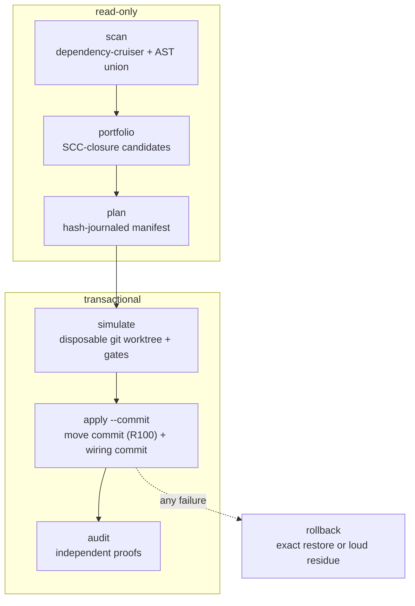

# Concepts

This page explains the model behind Monocarve: what a plan is, how it is
simulated, applied, recovered, and audited, and what each proof does and does
not show. For a hands-on walkthrough, see [Getting started](getting-started.md).
For the operating procedure, see the [operator guide](operator-guide.md).
Terms are defined in the [glossary](#glossary) at the end.

## Why compile a refactor

Moving a package out of a mature application is simple to do and hard to
check. The steps are repetitive: move files, repoint imports, scaffold a
package, update the lockfile. The failures are silent. One file gets changed
during the move, one consumer still points at a path that resolves, or one
dynamic import becomes static. Reviewers cannot find those in a 400-file diff,
and tests do not necessarily catch them. Monocarve therefore compiles and
verifies the refactor instead of performing it by hand:

- **Deterministic.** The same repository, commit, and config produce the same
  plan, byte for byte. Even the manifest's `createdAt` is the baseline commit's
  committer date, not a clock reading.
- **Replayable.** The plan is a journal. Simulating it and applying it execute
  the same journal in different places.
- **Hash-verified.** Each operation states the hash it expects to find and the
  hash it must produce. Drift fails at the first operation, not halfway
  through.
- **Provable about content.** "Did any byte change?" comes down to hash
  comparisons, plus one replay proof for the one kind of operation that is
  allowed to edit content. The package boundary the plan promised is proven
  against the landed tree. Behavior is not proven. See
  [Evaluation effects](#evaluation-effects).
- **Reviewable.** The result is two commits: a pure-rename move commit that
  git reports as R100, and a wiring commit that holds every content change.

The config is the boundary between the engine and your workspace. Anything
the engine needs to know about a particular repository comes from
`monocarve.config.ts` (or `.json`), and nothing workspace-specific is
hardcoded. The config is validated with zod, so error messages give exact
field paths. The [configuration reference](configuration.md) lists every
field.

## The pipeline



### scan

`scan` builds a dependency model with dependency-cruiser. It runs with
`--ts-pre-compilation-deps`, so type-only edges are visible, because a
type-only escape is still an escape. The cruiser result is a starting point,
not the final answer. An AST pass adds unresolved workspace subpath imports,
`export *` re-exports, and dynamic `import()` specifiers. The output is reduced
to a small model, so a different scanner could replace dependency-cruiser.
Scans are cached by tree hash. `--no-cache` forces a rescan.

Graph-reading commands accept `--graph <app>=<file>`, which replays a scanner
report captured with `scan --report-out`. Scanning a large application takes
tens of seconds, and each invocation is a new process. Some commands require
fresh evidence and refuse captured reports: `campaign init`, `advance`, and
`record`, and `assess`.

### portfolio

`portfolio` enumerates candidates as SCC closures. It starts from a strongly
connected component, takes the component's transitive first-party closure, and
adds the tests that cover it and every asset it imports. Then it applies
eligibility rules:

| rule                       | meaning                                                                                             |
| -------------------------- | --------------------------------------------------------------------------------------------------- |
| containment                | no relative import leaves the closure…                                                              |
| …except rewritable escapes | …unless it reaches a symbol an existing package already exports; that becomes a `move-with-rewrite` |
| asset-inclusive closures   | a `./styles.css` import is allowed _because_ the asset moves too, byte for byte                     |
| single owner               | exactly one application owns the closure                                                            |
| no composition roots       | entrypoints and DI wiring never leave                                                               |
| has a surface              | something is exported, and something consumes it                                                    |
| not `.d.ts`-only           | types with no implementation belong somewhere else                                                  |

Crossing a runtime domain does not make a candidate ineligible. It lowers the
score and raises a warning, because that split is often exactly what the
extraction is meant to fix. A rejected candidate lists the concrete edges you
would have to break, and `backlog` prints them.

Eligibility and recommendation are reported separately. Eligibility is
mechanical. A recommendation (`recommended`, `discouraged`, …) is an
architectural judgment based on cohesion, domains, and target options. By
default `portfolio` shows recommended, cohesive candidates only, one
representative for each near-equivalent group. `--recommendation all` shows
every mechanically eligible candidate.

**Reading `portfolio` and `backlog`.** Both commands print a slice of one
partition, and both take `--limit` (default 20). The population counts never
depend on the limit:

```jsonc
{
  "schema": "portfolio",
  "totals": { "candidates": 662, "eligible": 136, "blocked": 526 }, // whole portfolio, always
  "limit": 20,
  "truncated": true, // more eligible candidates exist than `top` holds
  "top": [/* the highest-ranked eligible candidates, up to limit */],
  "selected": [/* ids */],
}
```

`backlog` has the same `totals`, `limit`, and `truncated` fields, and its `top`
holds the largest blocked candidates together with the edges to break. In both
outputs, `totals.eligible + totals.blocked === totals.candidates`. Read counts
from `totals`, never from `top.length`.

Some related commands analyze without editing. `conflicts` compares
same-baseline plans and groups them into path-disjoint waves. It never
declares two such plans safe to apply one after the other: once the first
lands, the second's journal hashes are stale, so every wave requires a rescan
and a replan in between. `symbols` and `split-candidates` report
declaration-level structure. They are diagnostic only.

### plan

`plan` compiles one candidate into a manifest. The manifest holds the baseline
commit, the source blob hashes, and an ordered journal of operations. Each
operation has a precondition hash and a result hash.

| operation           | what it does                                                                                                                                                                                          |
| ------------------- | ----------------------------------------------------------------------------------------------------------------------------------------------------------------------------------------------------- |
| `move`              | byte-identical relocation, so `resultHash === preconditionHash`. Assets move this way too.                                                                                                            |
| `rewrite-import`    | a consumer that stays in place, repointed at the new package (an AST edit)                                                                                                                            |
| `write-file`        | package scaffolding rendered from config templates                                                                                                                                                    |
| `lockfile-importer` | one importer block inserted at its sorted position, so a plan never embeds a whole lockfile. Both forms a package manager writes are read and produced: the block form and the inline `root: {}` form |
| `move-with-rewrite` | the only kind whose content changes as it moves. It is excluded from the R100 check and staged into the wiring commit as a delete plus an add                                                         |

Plans can also contain `rewrite-fs-reference`, `rewrite-path-reference`,
`delete-file`, and `migrate-path-keys` operations. They come from the
[path-migration](path-migrations.md) and reference-rewrite features.

The manifest also holds Conventional Commit subjects rendered from
`commitTemplates`, a declared `expectedDynamicImportDelta` that the audit
enforces, `projectedArtifacts` (the final hashes of structured outputs),
`dependencyDecisions` (the reason for each dependency added to or removed from
a package), a `boundaryBaseline` of pre-existing violations, and an
`evaluationEffects` inventory.

A plan either creates a new package or extends an existing one. If the target
root already contains `package.json`, the plan extends its exports,
entrypoint, dependencies, project references, and lockfile importer. Otherwise
it scaffolds a package from your templates. The result reports `targetMode`
(`new` or `existing`) and `targetPackageRoot`.

### Evaluation effects

A consumer is repointed at a barrel that re-exports the whole moved closure.
So importing the package can evaluate a module the consumer never named. The
`evaluationEffects` inventory records what _evaluating_ the new package does,
as distinct from calling it. The portfolio warns whenever the inventory is
not empty.

The inventory covers the evaluation closure, not just the moved set. Starting
from the moved files, it follows the edges that cause evaluation (static
imports, re-exports, `require`) through bare imports of workspace packages and
into those packages' modules. Each module is recorded as `moved` (at its
target path) or `reached` (not moved, but now evaluated by importers that
never named it). The inventory does not follow `type-only` edges, because
they are erased before anything runs, or `dynamic` edges, because `import()`
is lazy and `expectedDynamicImportDelta` already tracks it. It stops at
`node_modules`. A third-party package is recorded by name together with its
own `sideEffects` declaration, and "claims none", "says nothing", and "not
installed" are kept as three distinct answers.

Read it for what it is. It over-approximates: every top-level call counts, and
most are harmless. It is a syntactic scan, so a module missing from the
inventory has not been shown to be pure. It is a _set_, so it says nothing
about the order the barrel imposes, which matters when two modules' effects
interact.

## Plan identity

A manifest is bound to the conditions that produced it:

- **`planId`**: the candidate id (for example `c-09d8a524b603`).
- **`baselineCommit`**: the commit it was compiled against. A plan applies only
  at its own baseline, with exactly its approval commit on top.
- **`graphDigest`**: the dependency model it was compiled from.
- **`provenance.configDigest`**: a hash of the effective config.
- **`provenance.policyDigest`**: a hash of the commit templates, gates, and
  scaffold templates.
- **`provenance.adapters`**: the package-manager and task-runner adapter ids,
  their contract versions, and any declared tool version.
- **`provenance.compiler`**: the compiler identity. A distributed build is
  stamped at build time with an `artifactIntegrity` hash and a
  `sourceRevision`. When you run from source, the identity is a hash of the
  running checkout's `src/**/*.ts`, so any change to those files changes it.

Validation (`verify`, and the preflight of `apply` and `doctor`) recomputes
each of these values and refuses on any mismatch. For example:
`[config-digest] plan configuration digest does not match the effective configuration` or `[compiler-integrity] plan compiler identity does not match this compiler`. `refresh` recompiles a stale plan at the current `HEAD` into a
new, separate manifest. It accepts a new compiler but refuses config, policy,
adapter, source, closure, or target drift. In those cases you compile a new
plan. `monocarve --version --verbose` prints the identity of the running build.

### Provenance lives in the manifest, not in commit trailers

The committed manifest is the provenance record for an extraction. Together
with the retained audit report, its `planId`, baseline, source and operation
hashes, declared operations, and rendered commit metadata make the change
independently inspectable. Commit subjects and bodies are workspace policy,
rendered only from `commitTemplates`. A configured body is appended verbatim,
and the default body is empty. Monocarve does not add, require, or check an
`Extraction-Proof` trailer. A workspace may configure a trailer or co-author
line for its own process, but that line is not evidence of an extraction.

## Journal and transactions

A **journal** is the ordered operation list in a manifest. Executing it is
all-or-nothing. Before the first mutation, Monocarve snapshots every path the
transaction owns. If an operation's precondition hash does not match, or any
later step fails, it restores the snapshots, the pre-apply `HEAD`, and the
index (when that could be recorded), then verifies the restore. If the
restore cannot be verified, the report says `ROLLBACK INCOMPLETE` and lists
the `residue` paths. Monocarve never silently leaves a half-applied tree.

A committing apply produces:

1. the **move commit**, which contains only the declared renames and which git
   must report as R100, and
2. the **wiring commit**, which holds scaffolding, import rewrites, lockfile
   changes, `move-with-rewrite` results, and regenerated artifacts.

The approval commit that comes before them is yours. `approve --commit`
creates it, and it contains only the manifest.

## Simulation worktrees and gates

Every apply simulates first. The simulation creates a detached git worktree at
the baseline commit, outside the repository (see [Scratch root](#scratch-root)).
It then:

1. replays the journal,
2. provides `node_modules` according to `transaction.nodeModules`: `symlink`
   (the default), `install`, or `none`,
3. regenerates the declared **generated artifacts** and runs post-journal
   preparers,
4. audits the simulated tree and checks repository-wide postconditions. Every
   package manifest must agree with its lockfile importer, no dependency may
   appear in two manifest sections, and every `workspace:` dependency must
   name a registered package,
5. optionally verifies the lockfile against the real package manager
   (`--verify-lockfile`),
6. runs your gates in `package`, `project`, then `workspace` tiers. Commands
   in a tier may run concurrently up to `gates.maxConcurrency`. Tiers never
   overlap.

**Generated artifacts.** A move can make a registry, barrel, or ledger stale,
and the plan cannot write that file itself. Monocarve regenerates each
declared artifact whose `triggers` match. The plan records the command, and a
config that has gained an artifact the plan does not know about stops the run.
Regenerated paths land in the wiring commit, and a non-zero exit fails the
run with the generator's output attached.

**Worktree retention.** On success, the worktree is deleted when
`transaction.cleanup` is `true` (the default). A failed gate always keeps its
worktree, because the result's `gateRetry` gives the exact cwd and command
inside it. The full gate log is written beside that worktree and is reported
as `failedGate.logPath`. Logs are not redacted, so gate commands must not
print secrets. Other failures keep the worktree only when cleanup is off.
Runs killed with `SIGKILL` leave worktrees behind. `prune-worktrees` reclaims
them.

`apply` without `--commit`, `doctor`, and `next --apply` run a simulation only.
`apply --skip-gates` runs the simulation without gates. It still runs
validation, the journal, and the audit, but it is meant for fast feasibility
checks, not for landing a plan. `doctor` refuses it. Monocarve never caches
simulation evidence. Safe reuse would have to bind the plan, approval,
baseline, config, compiler, dependencies, generated outputs, gates, and
environment, so `apply --commit` always simulates again.

## Apply checkpoint and recovery

A committing apply holds an ownership lock in the git common dir
(`monocarve-apply.lock`) and records its phase in `monocarve-apply-state.json`.
The phases are `simulating`, `applying`, `move-committed`, and
`wiring-committed`. Before the first mutation, it writes a durable
**checkpoint** (`monocarve-apply-checkpoint.json`) that holds the pre-apply
`HEAD`, a tree object for the pre-apply index, and the bytes, mode, or link
target of every snapshotted path.

- **`SIGINT` or `SIGTERM`.** During the mutating window, the handler restores
  the rollback point, releases the lock, and exits with 130 or 143. The
  journal yields after each operation so the signal is handled between
  operations. Before that window (phase `simulating`) the handler only
  releases the lock. If the in-process restore fails, the lock, state, and
  checkpoint are all kept, with the state marked `applying` and `released`, so
  that `apply-recover` can retry it.
- **Unrecovered transactions block new applies.** An apply that stops without
  completing — a failed in-process restore, a rollback that left residue, or an
  interrupt past the mutating window — never releases its lock. A later
  `apply --commit` (with or without `--resume`) refuses instead of overwriting
  the state and checkpoint, and so does any apply that finds a state or
  checkpoint file without a lock. `apply-recover` is the only way forward. A
  `released` owner has declared it will not touch the checkout again, so
  recovery does not wait for its process to exit.
- **Changes made after the interruption.** Before restoring, `apply-recover`
  compares every checkpointed path, and every index entry that differs from
  the pre-apply index, with the states the transaction can explain: the
  pre-apply bytes, each operation's declared result, declared generated and
  preparer outputs, and the states the apply recorded in the checkpoint after
  its journal and after regeneration. Anything else, including staged paths
  outside the plan, is a post-interruption edit, and the restore is refused
  with the list of paths. `--discard-changes` restores over them anyway and
  reports what it discarded.
- **`SIGKILL`, a lost terminal, or a crash.** Nothing runs in-process, so the
  lock and checkpoint remain. `apply-status` is read-only and reports the plan,
  the phase, the owner process, and the recovery command. `apply-recover --plan <path>` refuses while the owner is alive or cannot be proven stopped.
  An owner counts as stopped only when its PID is gone or now belongs to a
  process with a different start time. For an owner stopped in the `applying`
  phase, it restores the checkpoint and verifies the restore, and releases
  nothing if verification fails. It also refuses if `HEAD` has moved beyond
  the checkpoint (other than the transaction's own move commit), if you are
  on a different branch, or if you run it from a different checkout. In every
  case it prints the exact `apply` command to run next, adding `--resume`
  only at the move-commit boundary.
- **`--resume`** accepts only two starting states: the approval commit, or the
  verified move commit with exactly the declared moves over the baseline.
  From the move commit, it completes the wiring commit.
- **Corrupt lock.** If the lock cannot be parsed, its owner cannot be
  identified. After you confirm that no apply is running,
  `apply-recover --plan <path> --force-corrupt-lock` moves the unreadable files
  aside and restores this plan's checkpoint if there is one. The flag is
  refused when the lock is readable or missing.

## Audit proofs

`audit --plan <path>` reads the tree as the plan left it. Each proof can fail
on its own:

- **Byte fidelity.** Every moved file, rewritten consumer, and written file
  hashes to what its operation declared.
- **Consumer completeness.** Monocarve compares specifiers _and_ re-resolves
  them, so no edge still points into a moved path.
- **Boundary rules.** No package-owned file imports application code, except
  for edges recorded in the plan's `boundaryBaseline`. Those are reported as
  `observed` or `cleared`.
- **External-consumer compile.** A fixture outside the workspace compiles
  against the new package, using the application's `compilerProfile`.
  `--skip-compile-proof` skips it.
- **Codemod replay.** Every `move-with-rewrite` file is re-derived from its
  baseline blob and must match byte for byte.
- **Entrypoint closure.** The _landed_ barrel is parsed, and any module it
  evaluates outside the set the plan declared is rejected.
- **Lockfile integrity, generated artifacts, source conservation, and graph
  evidence.** Graph evidence includes the dynamic-import multiset against
  `expectedDynamicImportDelta`.

The audit deliberately does not claim three things.

1. A `write-file` operation's bytes are reproduced, not judged. The landed
   `package.json`, `tsconfig.json`, task file, and barrel must hash to what the
   plan declared. That shows the tree holds the bytes the plan chose, not that
   they were the right bytes. The entrypoint-closure proof keeps the barrel
   honest, because it derives the expected barrel from `source.files` rather
   than from the operation.
2. `evaluationEffects` is declared and bounded, not verified. The audit proves
   that the barrel evaluates nothing outside the moved set. It does not claim
   those effects are harmless, and it does not walk the closure again, which
   would check the plan against the same code that produced it.
3. The lockfile check is internal consistency. The audit re-reads the landed
   block with the same parser that spliced it, which catches tampering and
   drift but not a splice the package manager itself would never write.
   `--verify-lockfile` (on `plan`, `apply`, `doctor`, and `next`) closes that
   gap: it regenerates the lockfile in the simulation worktree with the real
   package manager and fails on any difference, or on resolutions the
   importers name but the file lacks. It is opt-in because it costs a
   package-manager run. When requested, a missing or failing package manager
   is an error, never a skip.

Every equality is strict, so later changes to those paths make an old audit
fail. For example, a second extraction into the same package rewrites its
`package.json` and barrel, and the first plan's audit then fails. Audit a plan
right after it lands. `inspect-gates --plan <path>` is a companion tool. It
runs each gate separately against the landed plan and reports which files
each gate changed, so you can decide what to declare as generated.

## Reconciliation and receipts

These records are optional, immutable evidence created after apply. Neither
one ever changes the approved plan.

- **Receipt.** `receipt --plan <path>` requires the exact application-result
  commit and a passing audit, then compiles a record that binds the plan
  digest, the application commits, and the audit report. The command previews
  by default, and `--write` creates a new file.
- **Reconciliation.** If declared bytes later drift, so that the audit fails
  only on paths the plan owns, `reconcile --plan <path> --reason <text> --approval-subject <subject>` records each discrepancy (path, expected and
  actual state, and owning operation) in a separate linked record, after
  proving the original approval and application chain.
  `reconcile-approve --record <path> --commit` commits that record by itself.
  A receipt can then reference the approved reconciliation.
- **`status`** combines everything. It checks the approval and application
  boundaries, audits the tree, validates any receipt or reconciliation you pass
  it, reports durable transaction state, and prints exactly one next command.

## Preparation manifests and preparers

Sometimes the source has to change before an extraction can happen. For
example, a type-only seam has to be split out of a large file, or a boundary
declared. Monocarve compiles those changes into **preparation manifests**,
which are separate from extraction manifests, so the extraction's move commit
stays a pure rename.

- **Declaration preparation** (`seams`, `prepare-plan`, `prepare-multi-plan`,
  `prepare-apply`, `prepare-audit`) moves reviewed type-only declaration
  groups into a new module. It is opt-in. The workspace must configure
  `preparation.commit` and at least one `preparation.gates` command. Monocarve
  will not make up either policy or certify a source rewrite with no gates.
- **Boundaries** (`boundary review|compile|simulate|apply`) compile a
  substitution that a reviewer declared in `compositionBoundaries`,
  `portPromotions`, `modulePromotions`, or `generatedSourceAdoptions`. See
  the [operator guide](operator-guide.md#boundary-preparation).
- **Configured preparers** (`preparer-plan`, `preparer-simulate`,
  `preparer-apply`, `preparer-commit`, `preparer-bootstrap-commit`) are
  repository-owned policies that run before an extraction, such as promoting a
  quality ratchet. A preparer declares its outputs up front. Planning runs it
  in a disposable baseline worktree and refuses any undeclared write. The
  manifest captures the final output bytes, and application replays those
  reviewed bytes through a journal.

A preparer can use a command, declarative `replacements`, declarative
`creates`, or a combination. When several are present, they run in this
order: replacements, creates, command, then the optional `verify` command.

**Replacements** make small source edits without a helper script:

```ts
preparers: [
  {
    id: "tighten-widget-limit",
    phase: "pre-extraction",
    replacements: [{ path: "{sourcePath}", prefix: "export const widget = { ", before: "limit: 10", after: "limit: 20", suffix: " };" }],
    outputs: ["{sourcePath}"],
    commit: { subject: "refactor: tighten widget limit" },
  },
];
```

Replacements run in array order, and each one sees the result of the ones
before it. Every replacement needs `path`, `before`, `after`, and at least one
non-empty `prefix` or `suffix`, and its `path` must be listed in `outputs`.
The editable text is exactly `prefix + before + suffix`, and it must occur
exactly once. If there are multiple matches, the preparer refuses. A rerun is
idempotent only when the anchored after-state occurs exactly once, or when an
ordered chain on the same path and anchors is already at its final state. An
`after` string that appears somewhere else without the anchors does not count
as evidence that the edit landed. Only `path` is template-rendered. The
`before`, `after`, `prefix`, and `suffix` fields are literal, so braces in JSX
survive exactly.

**Creates** declare new UTF-8 files. Their paths are template-rendered and
added to the outputs automatically. Their contents are literal. The mode is
`0o644` by default, or `0o755`. Planning accepts a create only when the path
is missing or already holds exactly those bytes and that mode. It refuses
duplicate creates, overlap between replacements and creates, any other
existing state, and paths that escape the workspace.

## Scaffold templates are workspace policy

Monocarve has no built-in package scaffold. The root
`scaffoldTemplates.packageJson` is required. Every optional template (a
`tsconfig`, a task file, `extraFiles`, `devDependencies`, the barrel
convention) is absent unless you provide it. An application can override the
root templates. A template that includes a configured asset extension cannot
also make a blanket `sideEffects: false` claim.

For lazy-loaded modules, you can opt into module-preserving subpaths instead
of a barrel:

```ts
scaffoldTemplates: {
  // packageJson, tsconfig, taskFile, ...
  publicSurface: {
    mode: "subpaths",
    keyTemplate: "./{pathNoExtension}",
    targetTemplate: "./src/{path}",
  },
}
```

`{path}`, `{pathNoExtension}`, and `{pathJs}` come from each moved module's
path relative to the application. A new subpaths-only package gets an inert
entrypoint, so tools that read `main` never evaluate browser-only modules
eagerly. Each consumer is rewritten to the exact subpath it used before, so
`import("./AdminPage.tsx")` stays lazy and becomes
`import("@acme/admin/AdminPage")`. The audit re-resolves every declared
subpath, and the external-consumer proof compiles them. `plan --public-surface subpaths` selects this mode for a single plan.

## Campaigns

A **campaign** sequences many extractions. Current campaigns are defined by
stable source identities, not candidate ids, because candidate ids change
after every applied extraction:

```sh
monocarve campaign optimize --app storefront --out campaign.targets.json --write
monocarve campaign resolve --targets campaign.targets.json
```

`optimize` ranks targets by extracted lines of code per review unit and lists
coupling hotspots as preparation priorities. `resolve` rescans the current
`HEAD`, skips paths the application no longer owns, and compiles at most one
plan, then stops for review. It writes the plan only with `--write`. The older
`campaign init|status|advance|record` commands exist only to finish schema-v1
ledgers, which pair a preparation with an extraction. Those ledgers live
under `campaignDir` and must be git-ignored.

## Assessment evidence bundles

`assess --app <name> --evidence-dir <path>` captures one read-only scanner
baseline and publishes a hash-verified bundle: `summary.json`, `layers.json`,
`hotspots.json`, `portfolio.json`, `backlog.json`, `findings.md`, and
`input-inventory.json`, plus raw scanner reports. `--replay <bundle>`
re-derives the evidence and refuses if any input differs. Qualification is
`qualified` or `allowed-empty` (exit 0), `degraded` (exit 2, published with
package-dependent claims marked unavailable), or `fatal` (exit 1, nothing
published). An assessment is not a plan. It runs no gates, and it changes no
source or git state.

A TypeScript or ESM config for assessment runs inside a filesystem sandbox
(`bwrap` plus `strace`) using copies of its inputs, and any read outside those
copies is refused with `ASSESSMENT_CONFIG_UNBOUND`. The full rules are in
[Architecture assessment](assessment.md).

## Scratch root

Simulation worktrees, the external-consumer fixture, the preparer bootstrap
index, the config sandbox, and path-migration command directories must live
outside the repository, because anything created inside it would make the
tree dirty. The parent directory is resolved on each run, and the first match
wins:

1. `MONOCARVE_SCRATCH_ROOT`, if it is set to an absolute path. It is used
   exactly as given, with no suffix. A relative value is ignored.
2. `$XDG_CACHE_HOME/monocarve/<checkout>-<hash12>`.
3. `~/.cache/monocarve/<checkout>-<hash12>`.
4. `$TMPDIR/monocarve/<checkout>-<hash12>`, only when the home directory is
   unknown.

`<checkout>-<hash12>` is the basename of the git toplevel plus the first 12
hex digits of the SHA-256 of its realpath. So two checkouts, or two linked
worktrees, never share a root, and one checkout's `prune-worktrees` cannot
delete another's live simulation. Simulation worktrees go in `<root>/worktrees`
unless `transaction.worktreeRoot` overrides it. A cache directory is used
instead of `/tmp` because `/tmp` is often a RAM-backed tmpfs that can run out
of inodes while `df` still shows free space, and it is cleared on reboot,
taking the evidence from an interrupted run with it.

## Glossary

- **Adapter.** The package-manager (`pnpm`, `bun`) or task-runner (`moon`,
  `none`) integration that knows workspace membership, lockfile, and
  project-file formats.
- **Approval commit.** A commit that contains only the manifest, with the
  plan's rendered `commits.plan` subject, directly on top of the baseline.
- **Assessment evidence bundle.** The hash-verified, replayable directory
  that `assess` publishes.
- **Audit.** The independent post-apply proofs, run against the landed tree.
- **Baseline commit.** The commit a plan was compiled against. The plan
  applies only there.
- **Boundary baseline.** The package-to-application import edges that already
  existed at the baseline. They are recorded in the plan and tolerated by the
  audit.
- **Campaign.** An ordered sequence of extraction targets, resolved one
  reviewed plan at a time.
- **Candidate.** A potential extraction: an SCC closure with its tests and
  assets, identified as `c-<hash>`.
- **Checkpoint.** The durable rollback point a committing apply writes before
  its first mutation.
- **Composition root.** An entrypoint or DI wiring module that must stay in
  the application.
- **Config digest.** A hash of the effective config, recorded in plan
  provenance.
- **Compiler identity.** The build identity of the Monocarve that compiled a
  plan. A plan validates only under the same identity.
- **Consumer.** A file outside the moved closure that imports into it.
  Consumers are rewritten to the new package.
- **Evaluation effects.** What importing the new package evaluates, recorded
  as a bounded, syntactic inventory.
- **Gate.** A repository command from config, run in simulation in tiers
  (`package`, `project`, `workspace`).
- **Generated artifact.** A file that a move makes stale. It is regenerated
  by a declared command and committed in the wiring commit.
- **Journal.** The ordered, hash-checked operation list in a manifest. It
  applies completely or not at all.
- **Manifest (plan).** The compiled, immutable JSON description of one
  extraction.
- **Move commit / wiring commit.** The pure-R100 rename commit, and the
  commit that holds every content change.
- **Preparation manifest.** A separate, journaled plan for a source change
  that must land before an extraction.
- **Receipt.** An immutable record binding a plan to its application commits
  and a passing audit.
- **Reconciliation.** An immutable record, approved separately, that explains
  declared byte drift after apply.
- **Refresh.** Recompiling a stale plan at the current `HEAD` into a new
  manifest.
- **SCC closure.** A strongly connected component of the import graph plus
  everything it transitively imports inside the application.
- **Scratch root.** The directory outside the repository where Monocarve
  keeps disposable state.
- **Simulation.** Replaying a journal, and running gates, in a disposable
  worktree at the baseline.
